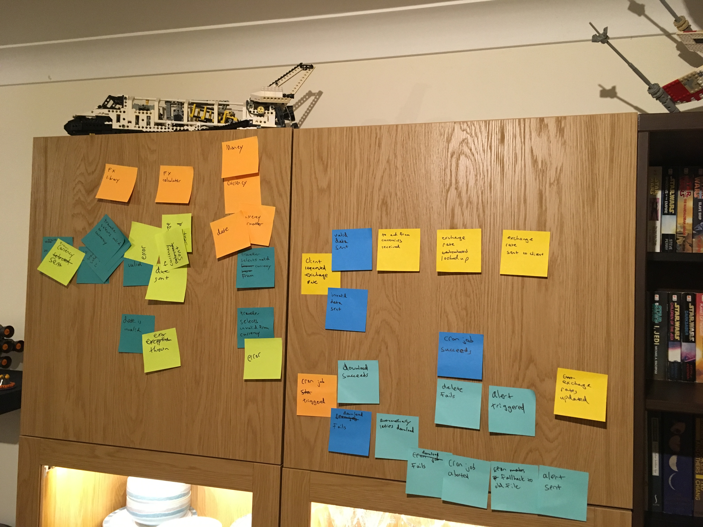

# CurrencyExchanger


## Installation

Add this line to your application's Gemfile:

```ruby
gem 'exchange_rate'
```

And then execute:

    $ bundle

Or install it yourself as:

    $ gem install exchange_rate

## Usage

TODO: Write usage instructions here

## Development

After checking out the repo, run `bin/setup` to install dependencies. Then, run `rake spec` to run the tests. You can also run `bin/console` for an interactive prompt that will allow you to experiment.

To install this gem onto your local machine, run `bundle exec rake install`. To release a new version, update the version number in `version.rb`, and then run `bundle exec rake release`, which will create a git tag for the version, push git commits and tags, and push the `.gem` file to [rubygems.org](https://rubygems.org).

To experiment with that code, run bin/console for an interactive prompt.

## Assumptions
In a job situation, I would clarify these assumptions but I decided that for the purposes of a tech test I could safely assume the following:
- Rates should be kept only for the previous 90 days
- Storing in a local file (as opposed to a DB) is fine
- I did not need to choose a production-level API to use but simply provide the functionality to plug in. 
(Many of the production
level APIs I looked at used JSON so there would be some different configuration but not much.)


## Design Process
- Used event storming to get a full sense of the domain. While this library is solely to 
get exchange rates and not to calculate currency conversion, I did storm the process from the UI
to get a full sense of the client's needs.




- Created a Trello board to make tickets and track my work. If this were in a job setting, I would work on separate branches but
as I am the only developer, I worked on a single branch. 

- Used TDD to build the library. I was originally trained at Makers in TDD so I am very comfortable with the process. Having recently been working through Ken Beck's TDD by Example and participated in workshops by Mathias Verraes,
this was a really interesting opportunity to introduce value objects with the TDD as a way of building the design.

- As this is a tech test, in order to preserve confidentiality I have not published it on GitHub or RubyGems.

## Design Considerations
- Use of value objects both guarantees objects' correct internal state, reducing the number of tests needed 
and also means the objects themselves are immutable, both of which provide further safety.
- Use of interfaces to tightly encapsulate communication. This would make it simple to plug in whatever production-level API is chosen
- Design based on sending messages rather than creating objects, as described in POODR
- Decided that at this stage, I did not need to set environment variables to determine dev/prod env. The classes and tests are 
sufficiently isolated that until a production API is chosen, there's no need to configure env variables.


## License

The gem is available as open source under the terms of the [MIT License](https://opensource.org/licenses/MIT).

## Code of Conduct

Everyone interacting in the CurrencyExchanger project’s codebases, issue trackers, chat rooms and mailing lists is expected to follow the [code of conduct](https://github.com/[USERNAME]/exchange_rate/blob/master/CODE_OF_CONDUCT.md).
