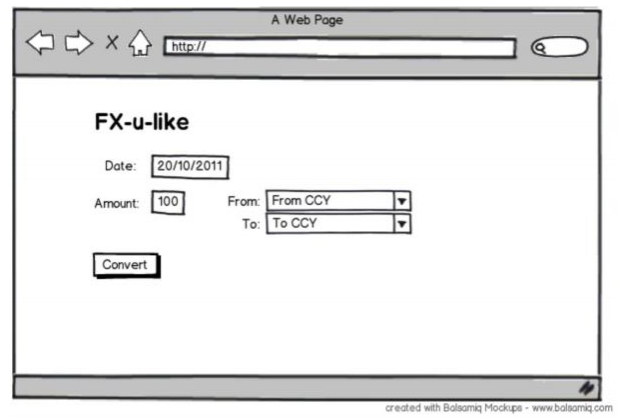

Your challenge for today is to delve deep into the work of foreign exchange (FX) to provide a
Ruby library​ for obtaining FX rates.

Interface

Here's how a client would expect to use the library where GBP is the base currency
and USD is the counter currency: 
```ExchangeRate.at(Date.today,'GBP','USD')```

Data Source
- During development, the data source of FX rates will be the 90 day European Central
Bank (ECB) feed:
http://www.ecb.europa.eu/stats/eurofxref/eurofxref-hist-90d.xml
- It's expected we'll use an alternative provider in production.

Data Storage
- We don't want to be dependant on the ECB website in order for our library to work,
so the data should be prefetched and stored locally.
- Your solution should provide a mechanism to be used by a scheduler like cron to
retrieve data once a day.
- When requesting a rate, the library should load it from the store, not from the feed.

Example UI
- Below is a rough example of what a UI that uses this library might look like to give
you an idea of its usage.



